# IIITD PYQs Platform

Welcome to the **IIITD PYQs Platform** – the ultimate, premium, student-driven repository and curriculum guide for IIIT-Delhi. 

This platform has been entirely redesigned with a highly responsive, modern glassmorphic aesthetic to ensure a seamless and engaging experience for students navigating past year papers, academic regulations, and curriculum structures.

---

## 🚀 Version & Feature Highlights

### **Version 1.0.0** (Current)
*The platform has undergone a massive UI/UX overhaul focusing on premium aesthetics, mobile responsiveness, and enhanced resource mapping.*

#### 1. **Premium Glassmorphic UI & Design System**
- **Theme**: Dark mode by default, featuring a highly refined palette consisting of deep teals (`#3FADA8`), subtle golds (`#D7D69D`), and rich dark backgrounds (`#0B0B0F`).
- **Cards**: Implemented unique glassmorphic cards with backdrop blur, glowing hover effects, and intricate border-radiuses matching across all pages (`var(--r-xl)`).
- **Backgrounds**: Signature dotted backgrounds with linear masks for depth.
- **Animations**: Subtle fade-up entry animations (`animate-fadeup`) and gradient shifting across all page headers.

#### 2. **Dynamic Subject & Curriculum Explorer (`/subjects`)**
- **Curriculum Mapping**: Complete mapping of IIITD courses categorized by Branch (CSE, ECE, CSAM, CSAI, etc.) and Semester.
- **Toggle Views**: Switch between a beautiful Grid View and a compact List View for subjects.
- **Interactive Accordions**: Filter courses by semester to view core, core-elective, and elective classifications.
- **Advanced Search**: Intelligent client-side search that matches by course code, full name, or branch.

#### 3. **The "B.Tech Journey" & Resources Hub (`/resources`)**
- **Most Searched Portals**: Direct, stylish links to the ERP, AXIS, and SG/CW portals, indicating VPN requirements.
- **Academic Regulations**: Centralized links to official B.Tech regulations for every branch.
- **Interactive Journey Timeline**: A highly detailed, beautifully designed vertical timeline mapping out all 8 semesters of the B.Tech degree:
  - Branch Transfer rules (Regulation 7.6).
  - SG/CW and Summer Term strategies.
  - Placements, Internships (6-month & summer), and absenteeism penalties.
- **Mobile Optimized**: The timeline and resource grids have been meticulously optimized for smaller screens with reduced padding, perfectly scaled markers, and tight typography.

#### 4. **Dynamic Contributors Dashboard (`/contributors`)**
- **Live GitHub Fetching**: Automatically fetches contributor data directly from the official repositories (`NalishJain/IIITD-PYQs` for source files and `Keshav-Chaudhary/pyq-iiitd` for website development).
- **Interactive Podium UI**: The top 3 PYQ contributors are celebrated on a dynamic, staggered 3D-effect podium with metallic rank gradients (Gold, Silver, Bronze) and dynamic text truncation.
- **Stats & CTA Sidebars**: Desktop users experience a fully utilized 3-column dashboard grid. The left sidebar securely fetches and displays live repository stats (Stars, Forks, Issues). The right sidebar hosts an inline "How to Contribute" guide.
- **Floating Avatar Layout**: Website developers are showcased in a unique layout where avatars "float" out of the top of their glassmorphic cards, scaling dynamically on hover.
- **Resilient Skeleton & Error States**: Intricately designed skeleton loaders mimic the exact geometry of the podium and sidebars. If the GitHub API rate-limits the user, the layout seamlessly degrades into a beautifully styled red-dashed error dashboard without breaking the page structure.

#### 5. **Revamped Home Page (`/`)**
- Features a glowing mesh background.
- "Zero Friction" and "No Signup Required" transparent badging.
- Quick chips for immediate navigation to popular branches and portals.
- Dynamic stat panels summarizing total courses and active branches.

#### 6. **Recent Refinements**
- **Course Code Integration**: The Subject Details page now elegantly maps and displays formal IIITD course codes (e.g., `CSE102`, `MTH201`) seamlessly alongside the course name.
- **Mobile Responsive Contributors**: The 3D podium UI, error state fallbacks, and skeleton loaders on the Contributors dashboard now flawlessly scale down and adapt perfectly to mobile screens.
- **Polished Animations**: Perfected the CSS `@keyframes pulse` skeleton loading states across all dashboard widgets and refined the static/blinking behavior of error-state avatars.

## 📸 Platform Previews

### 1. Home / Landing Page
| Web View | Mobile View |
| :---: | :---: |
| 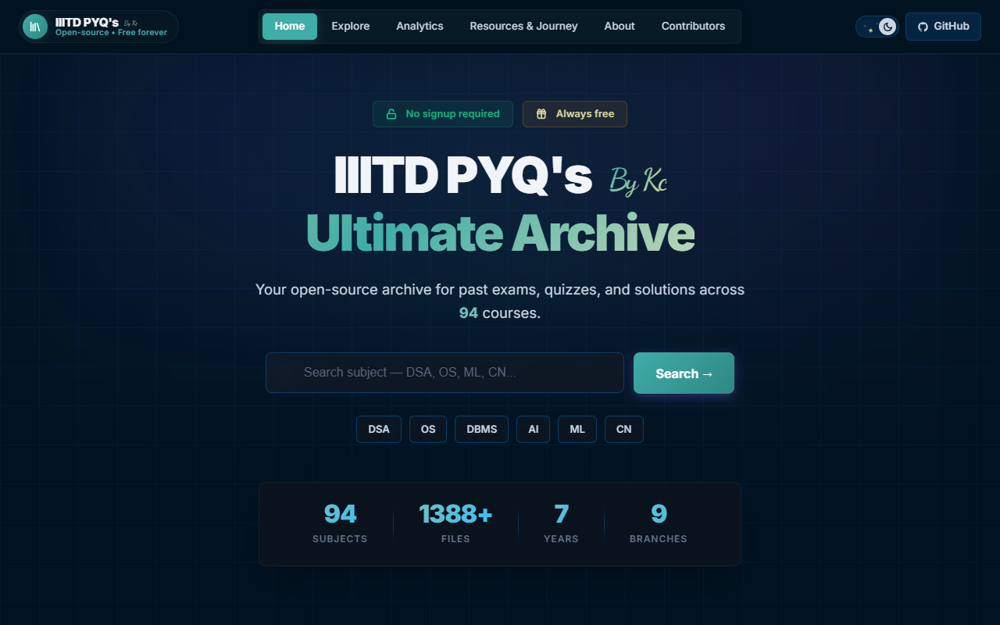 | 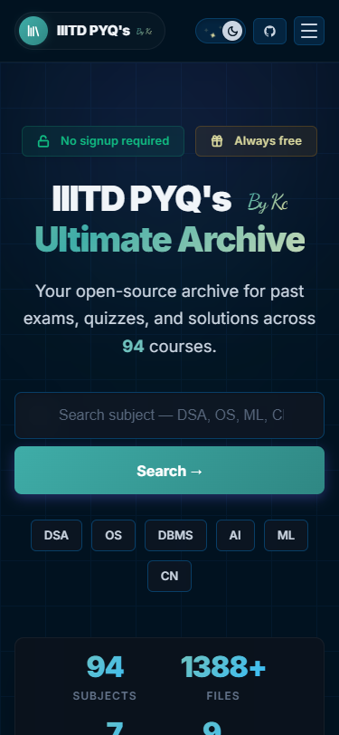 |

### 2. Menu Bar / Navigation
| Web View | Mobile View |
| :---: | :---: |
| 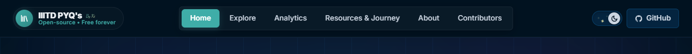 | 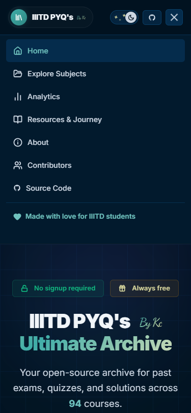 |

### 3. Subjects Explorer (`/subjects`)
| Web View | Mobile View |
| :---: | :---: |
| 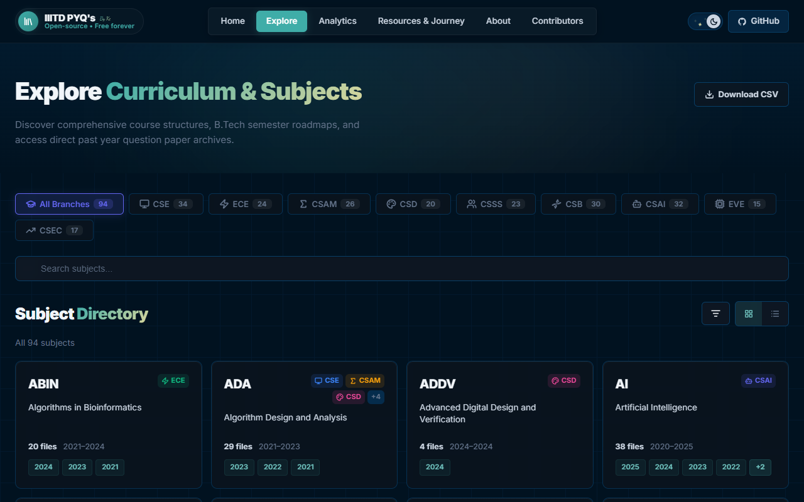 | 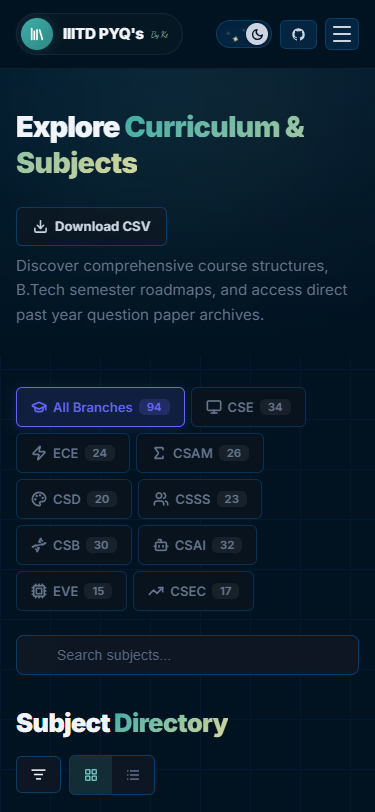 |

### 4. Subject Details (`/subject/:id`)
| Web View | Mobile View |
| :---: | :---: |
| 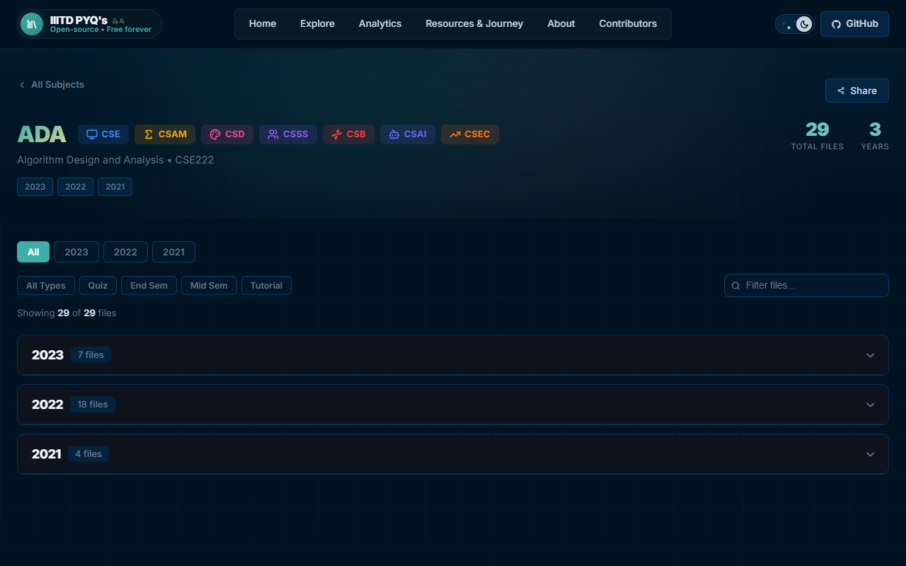 | 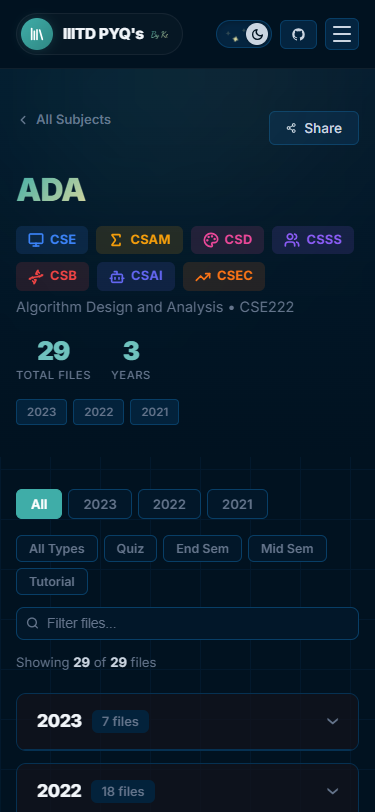 |

### 5. Resources Hub & Timeline (`/resources`)
| Web View | Mobile View |
| :---: | :---: |
| 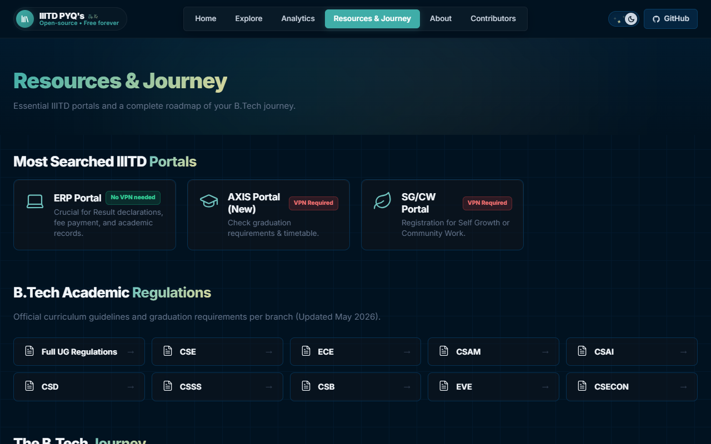 | 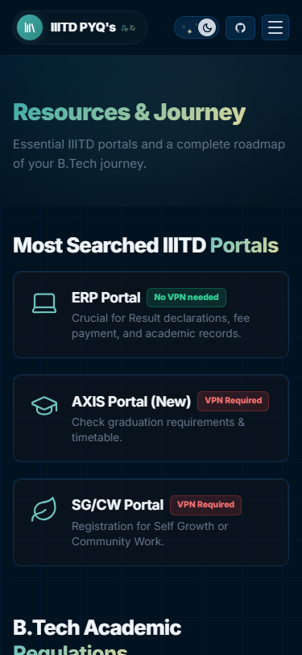 |

### 6. Contributors Dashboard (`/contributors`)
| Web View | Mobile View |
| :---: | :---: |
| 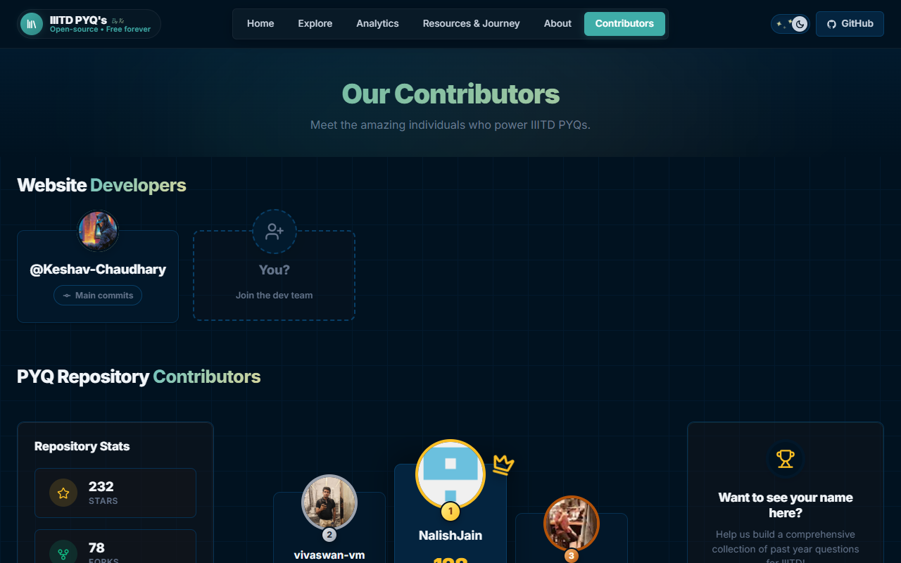 | 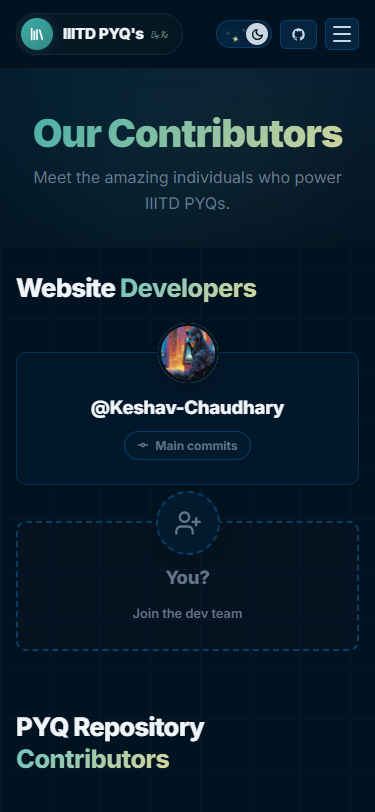 |

### 7. Analytics (`/analytics`)
| Web View | Mobile View |
| :---: | :---: |
| 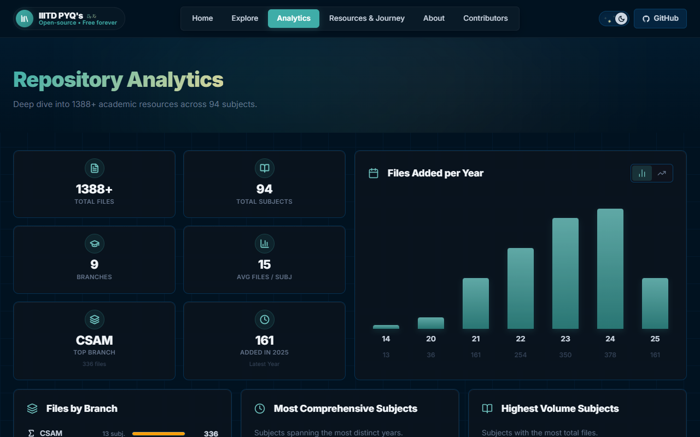 | 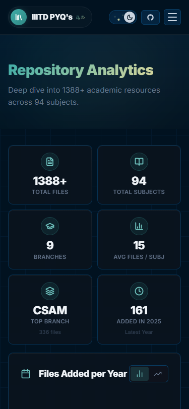 |

---

## 🛠 Tech Stack

- **Framework**: React.js (Vite)
- **Routing**: React Router DOM
- **Icons**: Lucide React
- **Styling**: Pure, highly-optimized Vanilla CSS utilizing CSS Variables (`index.css`) for seamless theme management. No bulky UI libraries; completely bespoke design.

---

## 🏃‍♂️ Getting Started

To run the platform locally:

1. **Clone the repository**
2. **Install dependencies**:
   ```bash
   npm install
   ```
3. **Start the development server**:
   ```bash
   npm run dev
   ```
4. Open `http://localhost:5173` in your browser.

---

## 🤝 Contributing

Contributions to both the PYQ archive and the website source code are always welcome.

- **Source File Contributions**: Head over to the [NalishJain/IIITD-PYQs](https://github.com/NalishJain/IIITD-PYQs) repository to upload past year papers, assignments, or notes.
- **Website Contributions**: If you want to build features or squash bugs, check out the website repository.

All contributors will be automatically featured on the `/contributors` page!

---

*Built with ❤️ for the IIITD Community.*
